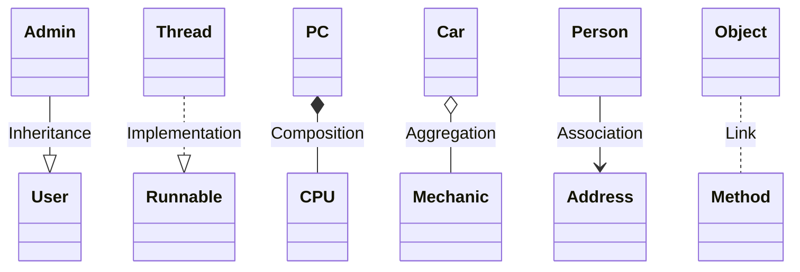

### Class Diagram

```mermaid
classDiagram
Admin --|> User : Inheritance
Thread ..|> Runnable : Implementation
PC *-- CPU : Composition
Car o-- Mechanic : Aggregation
Person --> Address : Association
Object .. Method : Link
```
1. Admin extends User.
2. Thread implements Runnable.
3. PC has a CPU.
4. Car has a Mechanic.
5. Person has an Address.
6. Object linked with Method.
