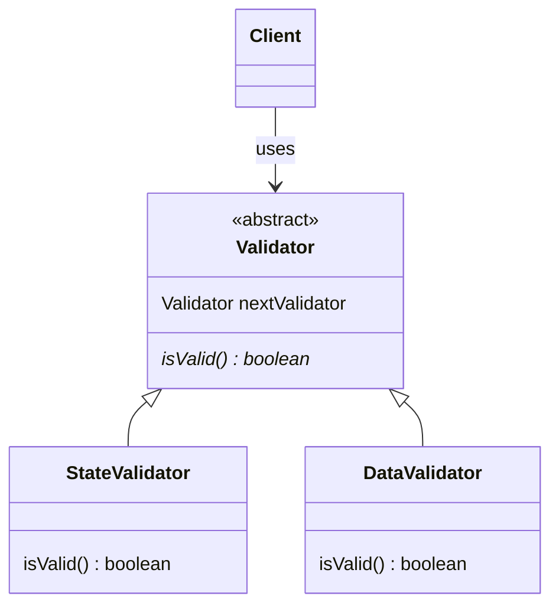

## Chain of Responsibility

Позволяет передавать объект по цепочке обработчиков, пока не находится обработчик, способный его обработать или пока его не обработают все обработчики.



```java
@NoArgsConstructor
public abstract class Validator {
    protected Optional<Validator> nextValidator;

    public Validator(Validator nextValidator) {
        this.nextValidator = Optional.of(nextValidator);
    }

    public abstract boolean isValid(Object obj);
}
```

```java
@NoArgsConstructor
public class StateValidator extends Validator {

    public StateValidator(Validator validator) {
        super(validator);
    }

    @Override
    public boolean isValid(Object obj) {
        if (isStateValid(obj)) {
            if (nextValidator.isPresent()) {
                return nextValidator.get().isValid(obj);
            }
            return true;
        }

        return false;
    }

    private boolean isStateValid(Object obj) {
        // some logic
        return false;
    }
}
```

```java
@NoArgsConstructor
public class DataValidator extends Validator {

    public DataValidator(Validator validator) {
        super(validator);
    }

    @Override
    public boolean isValid(Object obj) {
        if (isDataValid(obj)) {
            if (nextValidator.isPresent()) {
                return nextValidator.get().isValid(obj);
            }
            return true;
        }

        return false;
    }

    private boolean isDataValid(Object obj) {
        // some logic
        return false;
    }
}
```
