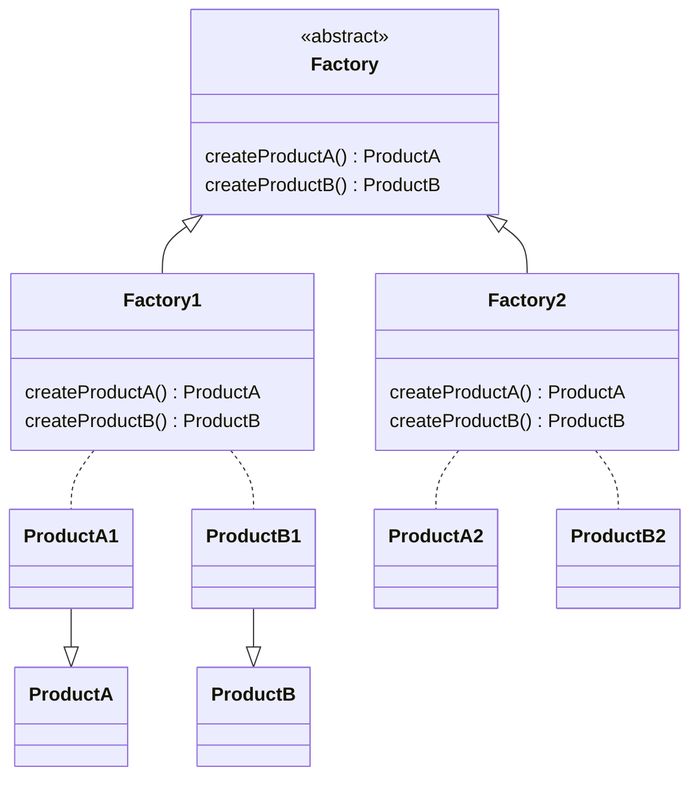

## Abstract Factory

#### How-to:

Абстрактный класс фабрики для создания связанных объектов. Реализация определяет фактическую группу объектов.

```mermaid
classDiagram
  class Factory{
    <<abstract>>
    createProductA() ProductA
    createProductB() ProductB
  }
   
  class Factory1{
    createProductA() ProductA
    createProductB() ProductB
  }
  
  class Factory2{
    createProductA() ProductA
    createProductB() ProductB
  }
  
  class ProductA{
  }
  
  class ProductB{
  }
  
  class ProductA1{
  }
  
  class ProductB1{
  }
  
  class ProductA2{
  }
  
  class ProductB2{
  }
  
  Factory <|-- Factory1
  Factory <|-- Factory2
  Factory1 .. ProductA1
  Factory1 .. ProductB1
  Factory2 .. ProductA2
  Factory2 .. ProductB2
  ProductA1 --|> ProductA
  ProductB1 --|> ProductB
```