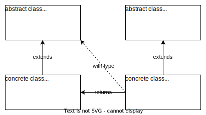

## Factory Method

Определен общий интерфейс или класс для создания объектов, реализующие классы могут изменять тип создаваемых объектов.



```java
abstract class Department {
    public abstract Employee createEmployee();
}

class ItDepartment extends Department {
    public Employee createEmployee() {
        return new Programmer();
    }
}

class AccountingDepartment extends Department {
    public Employee createEmployee() {
        return new Accountant();
    }
}

abstract class Employee {
}

class Programmer extends Employee {
}

class Accountant extends Employee {
}
```