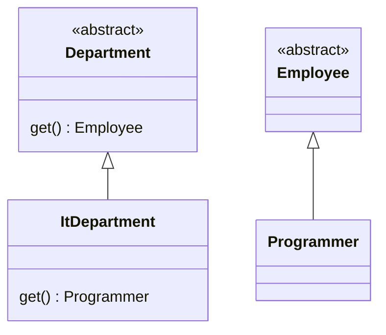

## Factory Method

Метод с общим интерфейсом для создания объектов, реализующие классы могут изменять тип создаваемых объектов.



```java
abstract class Department {
    public abstract Employee getEmployee();
}

class ItDepartment extends Department {
    @Override
    public Programmer getEmployee() {
        return new Programmer();
    }
}

abstract class Employee {
}

class Programmer extends Employee {
}
```