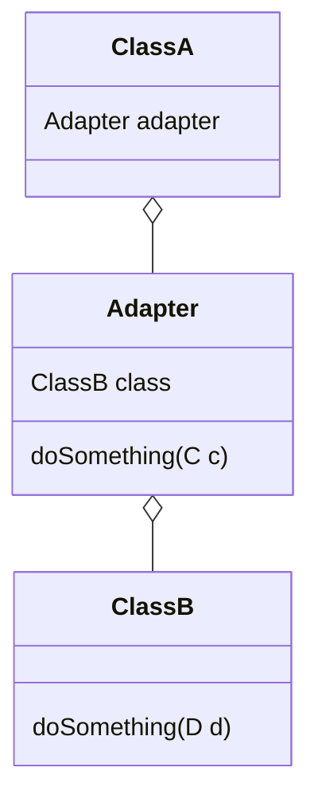

## Adapter

Дает возможность объектам с несовместимыми интерфейсами работать вместе.

```mermaid
classDiagram

    class ClassA {
        Adapter adapter
    }

    class Adapter {
        ClassB class
        doSomething(C c)
    }

    class ClassB {
        doSomething(D d)
    }

    ClassA o-- Adapter
    Adapter o-- ClassB

```