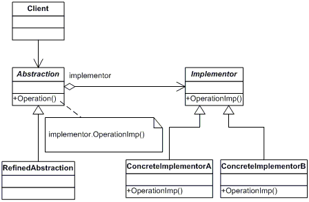

## Bridge
Позволяет разделить большой класс на несколько отдельных, которые потом можно развивать отдельно друг от друга.



```java
@RequiredArgsConstructor
public abstract class Car {
    protected final Engine engine;

    public abstract void drive();
}

public class Honda extends Car {

    public Honda(Engine engine) {
        super(engine);
    }

    @Override
    public void drive() {
        engine.start();
    }
}

public abstract class Engine {

    public abstract void start();
}

public class M8 extends Engine {

    @Override
    public void start() {
        System.out.println("Engine started");
    }
}
```