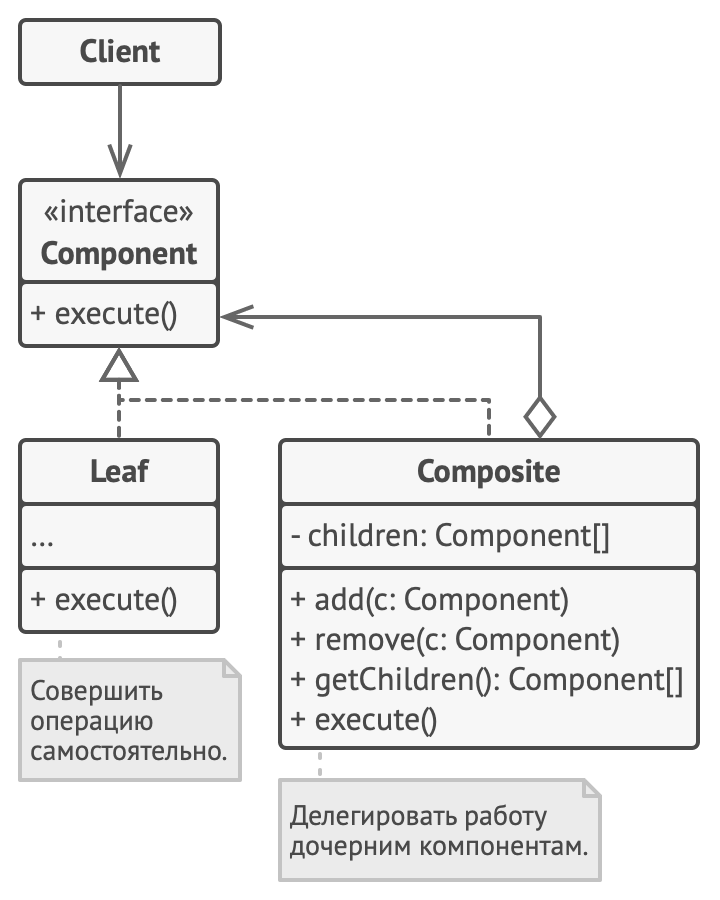

## Composite
Позволяет создать дерево объектов и работать с ним как с единым объектом.



```java
public abstract class Item {
    protected BigDecimal price;

    public Item(String price) {
        this.price = new BigDecimal(price);
    }

    public BigDecimal getCost() {
        return price;
    }
}

public class Box extends Item {
    private final List<Item> itemList = new ArrayList<>();

    public Box() {
        super("10");
    }

    public void addItem(Item... items) {
        itemList.addAll(List.of(items));
    }

    public void removeItem(Item item) {
        itemList.remove(item);
    }

    @Override
    public BigDecimal getCost() {
        return itemList.stream()
                .map(Item::getCost)
                .reduce(price, BigDecimal::add);
    }
}

public class Phone extends Item {

    public Phone(String price) {
        super(price);
    }
}

public class Watch extends Item {

    public Watch(String price) {
        super(price);
    }
}

public class Main {

    public static void main(String[] args) {
        var orderBox = new Box();

        var phoneBox = new Box();
        phoneBox.addItem(new Phone("10000"));
        orderBox.addItem(phoneBox);

        var watchBox = new Box();
        watchBox.addItem(new Watch("4000"));
        orderBox.addItem(watchBox);

        System.out.println("Cost: " + orderBox.getCost());
    }
}
```