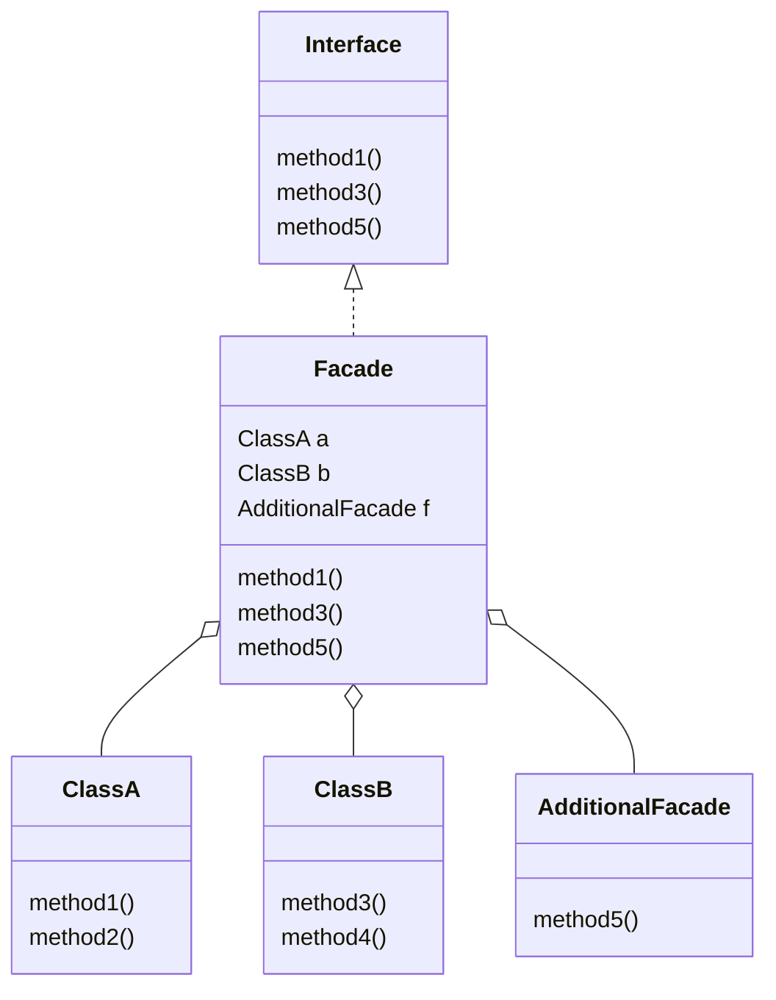

## Facade

Упрощает применение класса/классов, предоставляет методы, которые нужны клиенту, и скрывает все остальные.

```mermaid
classDiagram

    class Interface {
        method1()
        method3()
        method5()
    }

    class Facade {
        ClassA a
        ClassB b
        AdditionalFacade f
        method1()
        method3()
        method5()
    }

    class ClassA {
        method1()
        method2()
    }

    class ClassB {
        method3()
        method4()
    }

    class AdditionalFacade {
        method5()
    }

    Interface <|.. Facade
    Facade o-- ClassA
    Facade o-- ClassB
    Facade o-- AdditionalFacade

```
