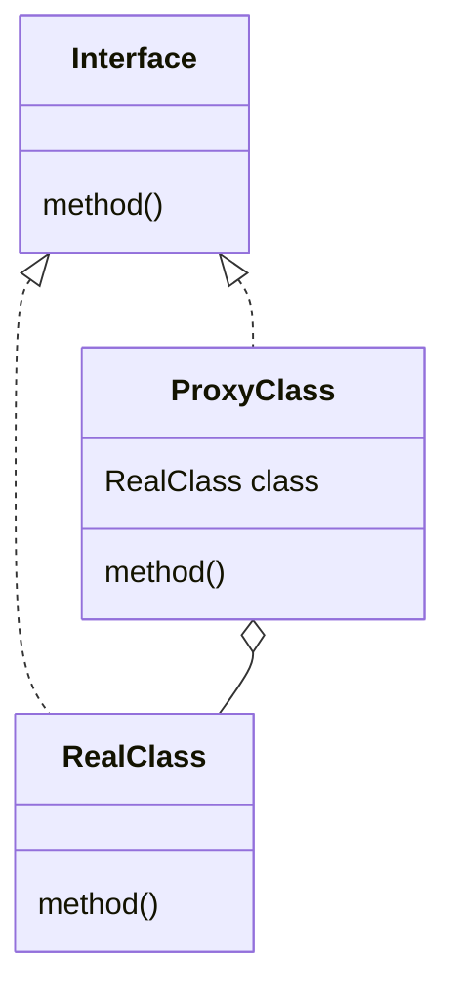

## Proxy

Позволяет подставлять вместо реальных объектов proxy-объекты. Эти объекты перехватывают вызовы к оригинальному объекту, позволяя сделать что-то до или после передачи вызова оригиналу.

```mermaid
classDiagram

    class Interface {
        method()
    }

    class ProxyClass {
        RealClass class
        method()
    }

    class RealClass {
        method()
    }

    Interface <|.. ProxyClass
    Interface <|.. RealClass
    ProxyClass o-- RealClass

```