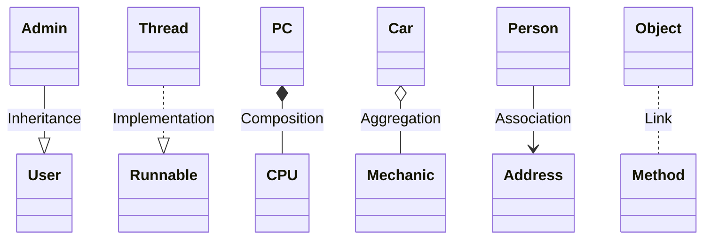

## Class Diagram

```mermaid
classDiagram
  Admin --|> User : Inheritance
  Thread ..|> Runnable : Implementation
  PC *-- CPU : Composition
  Car o-- Mechanic : Aggregation
  Person --> Address : Association
  Object .. Method : Link
```
- Admin extends User.
- Thread implements Runnable.
- PC has a CPU.
- Car has a Mechanic.
- Person has an Address.
- Object linked with Method.
